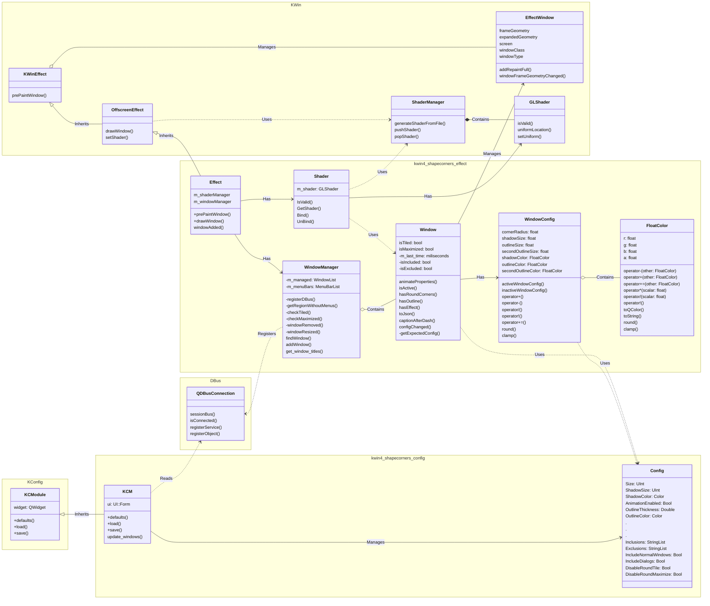

# KDE-Rounded-Corners Class Diagram

```mermaid
classDiagram
    direction LR
    
    namespace KWin {
        class KWinEffect {
            prePaintWindow()
        }
        
        class EffectWindow {
            frameGeometry
            expandedGeometry
            screen
            windowClass
            windowType
            addRepaintFull()
            windowFrameGeometryChanged()
        }
        
        class OffscreenEffect {
            drawWindow()
            setShader()
        }
        
        class GLShader {
            isValid()
            uniformLocation()
            setUniform()
        }
        
        class ShaderManager {
            generateShaderFromFile()
            pushShader()
            popShader()
        }
    }

    namespace DBus {
        class QDBusConnection {
            sessionBus()
            isConnected()
            registerService()
            registerObject()
        }
    }
    
    namespace KConfig {
        class KCModule {
            widget: QWidget
            +defaults()
            +load()
            +save()
        }
    }
    
    namespace kwin4_shapecorners_effect {
        class Effect {
            m_shaderManager
            m_windowManager
            +prePaintWindow()
            +drawWindow()
            windowAdded()
        }
        
        class WindowManager {
            -m_managed: WindowList
            -m_menuBars: MenuBarList
            -registerDBus()
            -getRegionWithoutMenus()
            -checkTiled()
            -checkMaximized()
            -windowRemoved()
            -windowResized()
            findWindow()
            addWindow()
            get_window_titles()
        }
        
        class WindowConfig {
            cornerRadius: float
            shadowSize: float
            outlineSize: float
            secondOutlineSize: float
            shadowColor: FloatColor
            outlineColor: FloatColor
            secondOutlineColor: FloatColor
            activeWindowConfig()
            inactiveWindowConfig()
            operator+()
            operator-()
            operator/()
            operator!()
            operator+=()
            round()
            clamp()
        }
        
        class Window {
            isTiled: bool
            isMaximized: bool
            -m_last_time: miliseconds
            -isIncluded: bool
            -isExcluded: bool
            animateProperties()
            isActive()
            hasRoundCorners()
            hasOutline()
            hasEffect()
            toJson()
            captionAfterDash()
            configChanged()
            -getExpectedConfig()
        }
        
        class Shader {
            m_shader: GLShader
            IsValid()
            GetShader()
            Bind()
            UnBind()
        }
        
        class FloatColor {
            r: float
            g: float
            b: float
            a: float
            operator-(other: FloatColor)
            operator+(other: FloatColor)
            operator+=(other: FloatColor)
            operator*(scalar: float)
            operator/(scalar: float)
            operator!()
            toQColor()
            toString()
            round()
            clamp()
        }
    }
    
    namespace kwin4_shapecorners_config {
        class KCM {
            ui: UI::Form
            +defaults()
            +load()
            +save()
            update_windows()
        }
        
        class Config {
            Size: UInt
            ShadowSize: UInt
            ShadowColor: Color
            AnimationEnabled: Bool
            OutlineThickness: Double
            OutlineColor: Color
            .
            .
            .
            Inclusions: StringList
            Exclusions: StringList
            IncludeNormalWindows: Bool
            IncludeDialogs: Bool
            DisableRoundTile: Bool
            DisableRoundMaximize: Bool
        }
    }
    
    KWinEffect <|-- OffscreenEffect: Inherits
    ShaderManager *-- GLShader: Contains
    KWinEffect o-- EffectWindow: Manages
    OffscreenEffect ..> ShaderManager: Uses

    OffscreenEffect <|-- Effect: Inherits
    Effect --> Shader: Has
    Effect --> WindowManager: Has
    Shader --> GLShader: Has
    Shader ..> Window: Uses
    Shader ..> ShaderManager: Uses
    Window --> WindowConfig: Has
    Window --> EffectWindow: Manages
    Window ..> Config: Uses
    WindowConfig o-- FloatColor: Contains
    WindowConfig ..> Config: Uses
    WindowManager o-- Window: Contains
    QDBusConnection <.. WindowManager: Registers
    
    KCModule <|-- KCM: Inherits
    KCM --> Config: Manages
    KCM ..> QDBusConnection: Reads
```