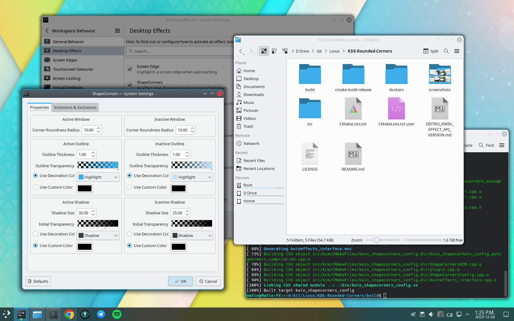

# KDE-Rounded-Corners

This effect rounds the corners of your windows and adds an outline around them without much affecting the performance of the KDE Plasma desktop (see [#49](https://github.com/matinlotfali/KDE-Rounded-Corners/pull/49) and [#50](https://github.com/matinlotfali/KDE-Rounded-Corners/issues/50)).

This effect started as a fork of [shapecorners](https://sourceforge.net/projects/shapecorners/) with some additional contributions in [Alex47's project](https://github.com/alex47/KDE-Rounded-Corners), then I optimized and reimplemented the effect with shaders with influences from the [invert effect](https://github.com/KDE/kwin/tree/master/src/plugins/invert).

**Tested on:**
-  
-  
 
-  
 
- 
     
-  
 
- 
 
- [  ](https://aur.archlinux.org/packages/kwin-effect-rounded-corners-git)



# Contributions:

- Compatibility of the effect with other effects like Wobbly windows
- Compatibility with KWin for Plasma versions 5.27 to 6.0
- Optimize the effect to render once instead of 5 times - see [#49](https://github.com/matinlotfali/KDE-Rounded-Corners/pull/49)
- Reimplementation with shaders to include shadows at corners and an outline
- Disable effect when windows get maximized
- Cleanups for the plugin logic, remove unneeded dependencies from CMakeLists.txt file - by [alex1701c](https://github.com/alex1701c)
- Separate outline color for active and inactive windows - by [OrkenWhite](https://github.com/OrkenWhite)
- Add natural shadows using parametric blend - by [paletteOvO](https://github.com/paletteOvO)

# How to build from source code:

You need to install development packages for your distribution first:

<details>
<summary>Debian based (Ubuntu, Kubuntu, KDE Neon)</summary>
<br>
    
  - Plasma 5 - by [alex47](https://github.com/alex47):
    ```
    sudo apt install git cmake g++ extra-cmake-modules kwin-dev libkf5configwidgets-dev 
    ```
  - Plasma 6
    ```
    sudo apt install git cmake g++ extra-cmake-modules kwin-dev qt6-base-dev-tools kf6-kcmutils-dev
    ```
</details>
<details>
<summary>Fedora</summary>
<br>

 - Plasma 5 (Fedora 39)
   ```bash
   sudo dnf install git cmake gcc-c++ extra-cmake-modules kwin-devel kf5-kconfigwidgets-devel libepoxy-devel
   ```
 - Plasma 6 (Fedora 40 and later)
   ```bash
   sudo dnf install git cmake gcc-c++ extra-cmake-modules kwin-devel kf6-kconfigwidgets-devel libepoxy-devel kf6-kcmutils-devel qt6-qtbase-private-devel wayland-devel
   ```
</details>
<details>
<summary>Arch - by https://github.com/hexa-one</summary>

  ```
  sudo pacman -S git cmake extra-cmake-modules base-devel
  yay -S qt5-tools
  ```
  or AUR package by [xiota](https://aur.archlinux.org/account/xiota)  
  ```
  sudo pamac build kwin-effect-rounded-corners-git
  ```
</details>
<details>
<summary>OpenSUSE - by https://github.com/mathiasgredal and https://github.com/Richardsause</summary>

  ```
  sudo zypper install git cmake gcc-c++ extra-cmake-modules libqt5-qttools-devel kconfigwidgets-devel kwindowsystem-devel kguiaddons-devel ki18n-devel knotifications-devel kwin5-devel libQt5Gui-devel libQt5OpenGL-devel libepoxy-devel libqt5-qtnetworkauth-devel
  ```
</details>
<details>
<summary>Void - by https://github.com/lay-by</summary>

  ```
  xbps-install git cmake make qt5-tools-devel extra-cmake-modules gettext-devel kwin-devel
  ```
</details>
<details>
<summary>NixOS - by https://github.com/flexagoon</summary>

   ```
   nix-env -iA nixos.kde-rounded-corners
   ```
</details>

Then clone the source code and compile it:
```bash
git clone https://github.com/matinlotfali/KDE-Rounded-Corners
cd KDE-Rounded-Corners
mkdir build
cd build
cmake .. --install-prefix /usr
make
sudo make install
```

# Load & Unload

To activate the effect, you can now log out and log back in, or run the command below inside the `build` directory:
```bash
sh ../tools/load.sh
```

To fully uninstall the effect, run the following commands inside the `build` directory:

```bash
sh ../tools/unload.sh
sudo make uninstall
```

# Auto install after KWin update

After each `kwin` package update, the effect becomes incompatible. So it won't load without a rebuild.

As long as the effect is not part of the `kwin` yet (being discussed 
[here](https://invent.kde.org/plasma/kwin/-/issues/198)), you can automate the re-installation by running the command
below inside the `build` directory:

```bash
sh ../tools/autorun-test-install.sh
```

The command above adds a `desktop` file inside the `autorun` directory which checks if the effect is still supported,
if it is not supported, it would automatically rebuild and reinstall the effect.

# Settings

You can change the corner radius, or disable the effect in:

> [ System Settings ] --> [ Workspace Behavior ] --> [ Desktop Effects ] --> [ ShapeCorners ]

# Tips

## Add shadow to windows without decoration (like Steam)

You can add shadows for specific windows using the hack below. I don't know how to enforce it in my code.

1. In [ System settings ] -> [ Window management ] -> [ Window rules ] -> [ Appearance & Fixes ]:

   **Add [steam] and set [ No titlebar ] and frame to [ No ]**
   
3. In [ System settings ] -> [ Application Style ] -> [ Window decoration ] -> [ Breeze theme setting ] -> [ Window specific overrides ]:

   **Add [steam] and set [ Hide Window title bar ] to [ Yes ].**

After that, the Steam window gets its shadows back.
