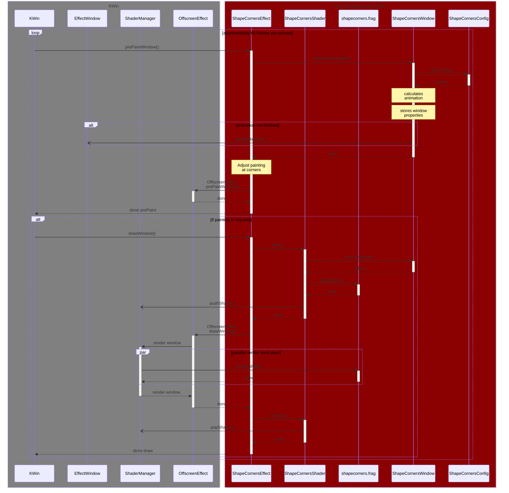

# KDE-Rounded-Corners Sequence Diagram

```mermaid
sequenceDiagram
    Box gray KWin
        participant KWin
        participant EffectWindow
        participant ShaderManager
        participant OffscreenEffect
    end
    Box darkred kwin4_shapecorners_effect
        participant ShapeCornersEffect
        participant ShapeCornersShader
        participant shapecorners.frag
        participant ShapeCornersWindow
        participant ShapeCornersConfig
    end

    loop approximately 60 frames per second
        KWin->>+ShapeCornersEffect: prePaintWindow()
        ShapeCornersEffect->>+ShapeCornersWindow: animateProperties()
        ShapeCornersWindow->>+ShapeCornersConfig: read config
        ShapeCornersConfig-->>-ShapeCornersWindow: values
        Note over ShapeCornersWindow: calculates<br>animation
        Note over ShapeCornersWindow: stores window<br>properties
        alt animation not finished
            ShapeCornersWindow-)EffectWindow: addFullRepaint()
        end
        ShapeCornersWindow-->>-ShapeCornersEffect: done
        Note over ShapeCornersEffect: Adjust painting<br>at corners
        ShapeCornersEffect->>+OffscreenEffect: OffscreenEffect::<br>prePaintWindow()
        OffscreenEffect-->>-ShapeCornersEffect: done
        ShapeCornersEffect-->>-KWin: done prePaint
        
        alt if painting is required
            KWin->>+ShapeCornersEffect: drawWindow()
            ShapeCornersEffect->>+ShapeCornersShader: Bind()
            ShapeCornersShader->>+ShapeCornersWindow: read properties
            ShapeCornersWindow-->>-ShapeCornersShader: values
            ShapeCornersShader->>+shapecorners.frag: setUniform()
            shapecorners.frag-->>-ShapeCornersShader: done
            ShapeCornersShader-)ShaderManager: pushShader()
            ShapeCornersShader-->>-ShapeCornersEffect: done
            ShapeCornersEffect->>+OffscreenEffect: OffscreenEffect::<br>drawWindow()
            OffscreenEffect->>+ShaderManager: render window
            par parallel render each pixel
                ShaderManager->>+shapecorners.frag: render shader
                shapecorners.frag-->>-ShaderManager: done
            end
            ShaderManager-->>-OffscreenEffect: render window
            OffscreenEffect-->>-ShapeCornersEffect: done
            ShapeCornersEffect->>+ShapeCornersShader: Unbind()
            ShapeCornersShader-)ShaderManager: popShader()
            ShapeCornersShader-->>-ShapeCornersEffect: done
            ShapeCornersEffect-->>-KWin: done draw
        end
    end
```